# The Myth of the Tailored Approach: Are Pitchers Treating All Hitters the Same?
## The Numbers Don’t Lie: Pitchers Still Challenge Judge and Ohtani — But Why?
By Scott Silverstein 

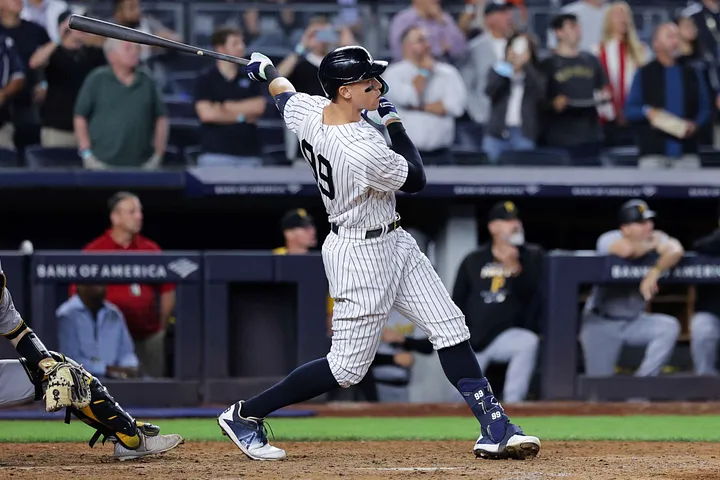

*He may be one of the best hitters in baseball history, but we wouldn’t know it by location data.*

### Introduction

**Why are pitchers still throwing strikes to Aaron Judge and Shohei Ohtani?**

That question has been bouncing around in my head for months.

These aren’t just good hitters — they’re once-in-a-generation talents. Judge is breaking records. Ohtani is rewriting what we thought was possible. And yet, they’re being pitched like... average stars. Not walked at Bonds-like rates. Still seeing pitches in the strike zone. Still getting challenged.

I’ve loved baseball since I was three years old. I’m still out there playing, chasing that perfect swing. To me, it’s the most cerebral game there is — full of nuance, psychology, and constant evolution. 

What excites me most today is how much the game has embraced data: FanGraphs, Baseball Savant, PhDs in front offices, and metrics like xFIP and wOBA have reshaped everything from scouting reports to in-game decisions.

And I’ve trusted that evolution. For the most part, I still do — maybe with the exception of the Rockies and White Sox. But this one thing doesn’t add up.

So I set out to find an answer.

I’ll start with history — how hitters like Barry Bonds were treated. Then I’ll narrow in: looking at how often Judge and Ohtani are walked, where they’re being pitched, and what types of pitches they see. Along the way, I’ll build models to test assumptions, validate instincts, and try to understand what might be the strangest strategy in modern baseball:

**Why are pitchers still challenging greatness?**

### Evolution of Pitching in the Strike Zone

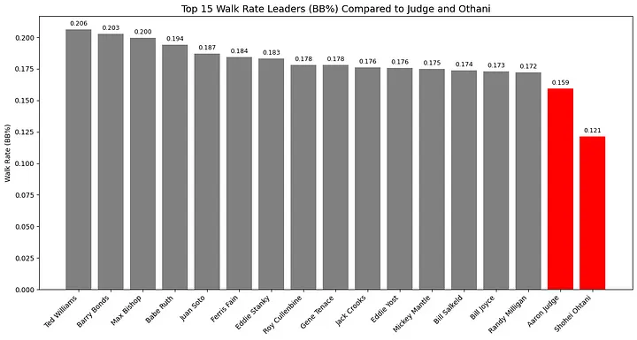

Aaron Judge is one of the best hitters of this generation — yet Ted Williams was walked over **29% more often** than Judge, and **70% more often** than Shohei Ohtani. This disparity extends to intentional walks as well:

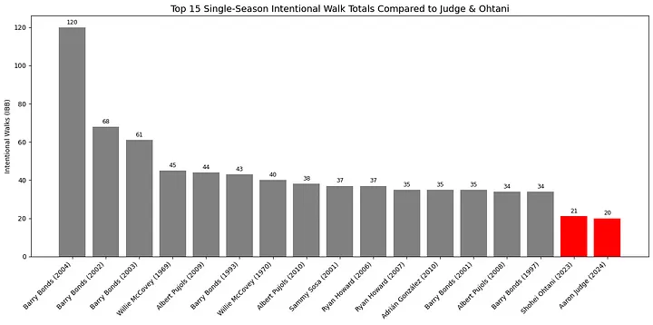

Barry Bonds was intentionally walked approximately **476% more** than Aaron Judge during their respective peak seasons.

This isn’t just about individual cases — it reflects a broader trend across MLB. Intentional walks have steadily declined since the 1990s and mid-2000s:

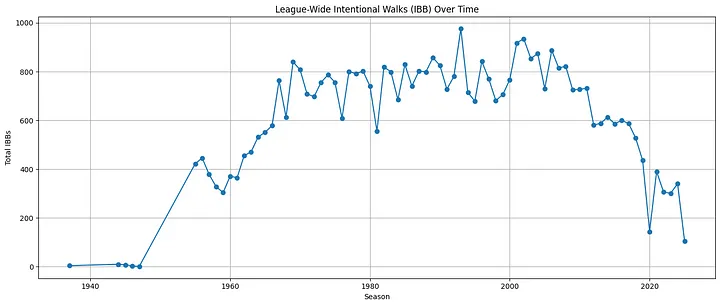

At the same time, pitchers are attacking the zone more aggressively overall. The percentage of pitches thrown in the strike zone has risen:

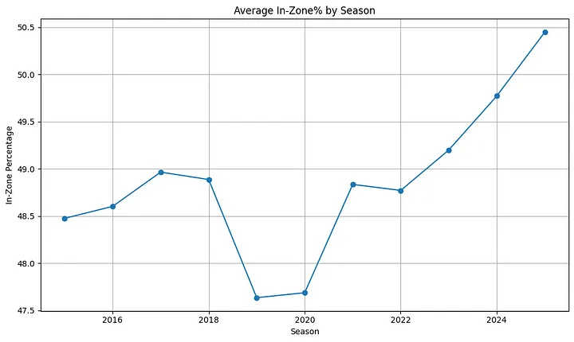

So, is this the answer? Are lower walk numbers simply a product of modern pitching trends? The data suggests that could be the case:

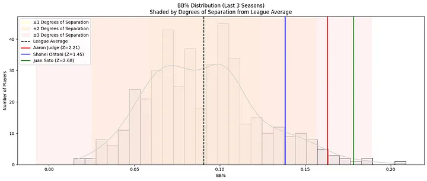

With the exception of Ohtani, Judge and other elite hitters are just one degree above the league average in walk rate over the past three years. So while they’re walked more than their peers, the gap is nowhere near what it was between Barry Bonds and the rest of the league in his prime.

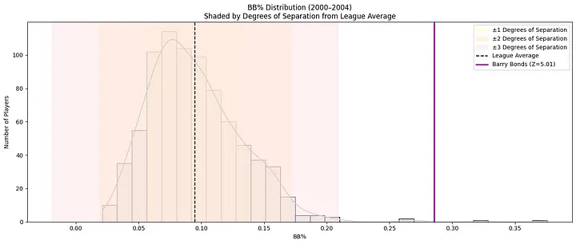

Bonds was unquestionably the most feared hitter of his era — and possibly of all time. Steroids aside, his statistical dominance made that clear. But Judge has also broken records and distanced himself from the rest of the league in a similar way. Bonds’ era and the current one may be the only two periods in baseball history where the title of “best hitter in the world” are virtually uncontested.

### Zoom In: Zone Percentage

The story gets even murkier when we look at how often top hitters actually see pitches in the strike zone.

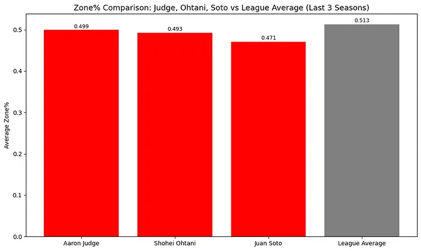

I used the last three seasons to ensure Ohtani’s data is comprehensive, while keeping the focus on Judge’s most dominant years.

Including Juan Soto — another widely regarded elite hitter — this chart shows that these stars are being pitched in the zone at rates very close to league average. In fact:

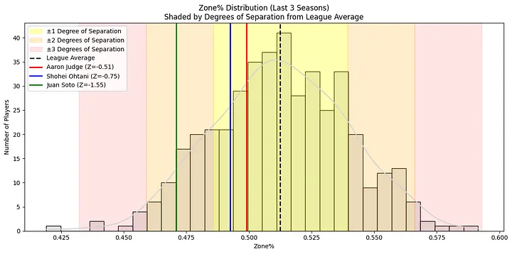

Judge and Ohtani are within **one degree of separation** from the league average zone%. Think about that — two of the best hitters in baseball are getting about the same percentage of strikes as Ryan McMahon of the Rockies, who posted a -11.3 offensive WAR in 2024. (No shade to McMahon — just context.)

That got me thinking: maybe pitchers throw strikes to Judge and Ohtani because they **don’t swing at bad pitches**. If that’s true, it should show up in their plate discipline.

---

#### Introducing the Plate Discipline Composite (PDC) Score

To test this idea, I created a new stat: the **Plate Discipline Composite (PDC)** — a 0–1 score that aggregates several advanced plate discipline metrics into one number.

**Metrics used:**

- *Inverted (lower is better)*: `O-Swing%`, `Z-Swing%`, `Swing%`, `SwStr%`, `F-Strike%`, `CSW%`
- *Positive (higher is better)*: `O-Contact%`, `Z-Contact%`, `Contact%`, `CStr%`, `BB%`, `Zone%`

**Steps:**

1. Normalize each stat on a 0–1 scale.
2. Invert the stats where lower values represent better discipline.
3. Average everything to create the final PDC Score.

This gives us a more holistic view of plate discipline — one that captures swing decisions, contact quality, and overall zone control.

---

### Eye Test: Does the PDC Score Work?

To see if the stat passed the sniff test, I compared a few known profiles:
- Javier Báez (notorious chaser)
- Juan Soto (elite zone controller)
- Judge and Ohtani

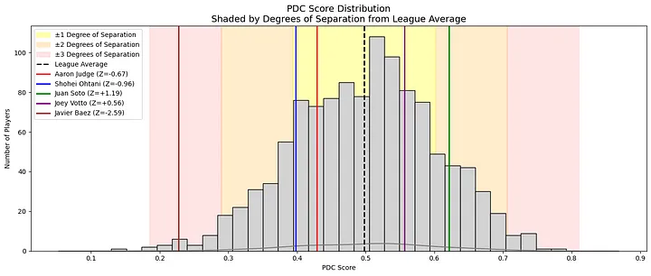

As expected, Báez ranked low and Soto ranked high — with Judge and Ohtani hovering around league average.

Still skeptical? Here’s a simpler comparison: just looking at the rate of swings on pitches outside the strike zone:

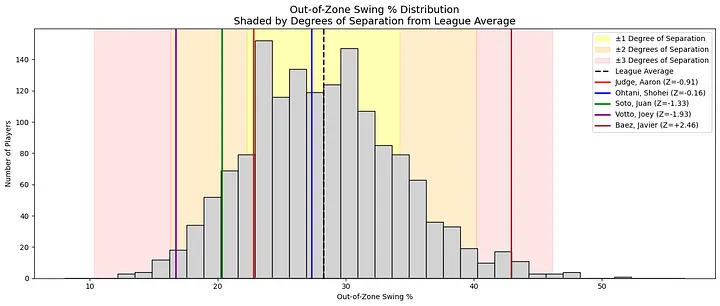

Same story — Judge and Ohtani chase at about average rates.

---

###  So Does Discipline Influence Zone%?

I was surprised by this. I expected a clear relationship between chase rate and how often pitchers throw in the zone. To investigate, I built a regression model:

- **Input (x-axis)**: `O-Swing%` (chase rate)
- **Output (y-axis)**: `Zone%` (how often hitters are pitched in the zone)

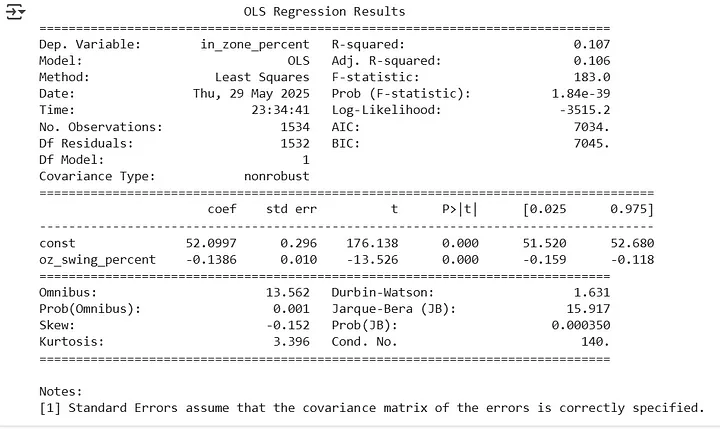

The result?

- **R² = 0.106** — a very weak relationship.
- While statistically significant (thanks to a strong p-value), the model only explains **10.6%** of the variation in Zone%.

---

### Takeaway

Yes, players who chase more may see more pitches in the zone — **but barely**. Plate discipline, at least measured this way, plays a **minimal role** in how pitchers choose to attack hitters.

The decision to throw strikes likely depends far more on context: pitch count, scouting reports, matchups, or even randomness. This adds another layer of mystery to why Judge and Ohtani aren’t avoided more often.

### Zoom In: Pitch Location

So clearly, great hitters are still seeing pitches in the strike zone. But what happens when we zoom in further — into **where** those pitches are located within the zone?

To explore this, I used Statcast's pitch zone model, which breaks pitch locations into four regions:

- **Heart**
- **Shadow**
- **Chase**
- **Waste**

Here’s the visual model from Baseball Savant:

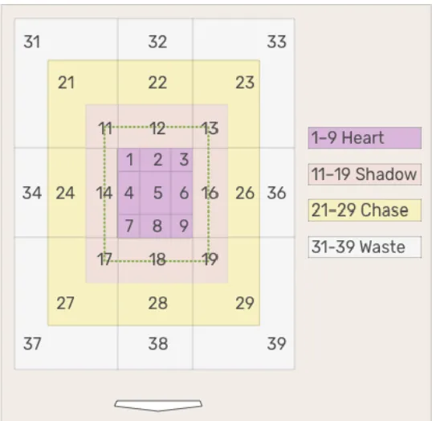

---

### 📊 Leaguewide Location Distribution

To understand league behavior, I calculated how pitches are distributed across these zones:

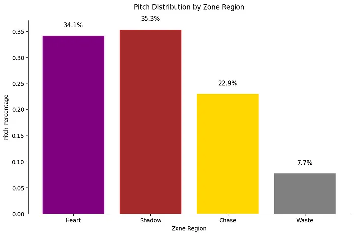

Most pitches land in the **Heart** and **Shadow** zones — areas close to or within the strike zone. That’s expected. Pitchers need to throw strikes to avoid walks and stay competitive.

What surprised me was how **small the gap** was between Heart and Shadow zones. I expected more pitches to hug the edges of the zone, given today’s emphasis on avoiding barrels and inducing weak contact.

One theory: modern pitchers often aim for the middle and rely on pitch movement to land on the edges. When those pitches don’t break as expected, they stay in the Heart — right where hitters do the most damage.

---

### 🎯 Where Are Pitchers Throwing to Judge, Ohtani, and Soto?

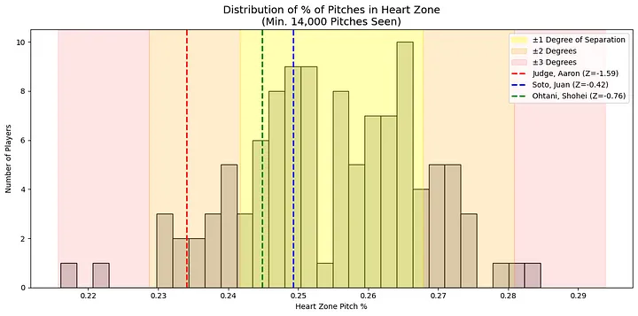

- Judge sees only about **1 percentage point fewer** pitches in the Heart than league average.
- Ohtani and Soto? Nearly **identical** to the league average.

That feels off — especially for Judge, who’s clearly not a “just above average” hitter.

To highlight the issue, I looked at **slugging percentage on Heart zone pitches**:

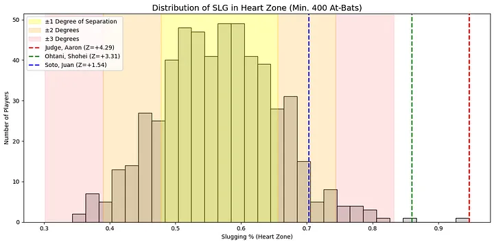
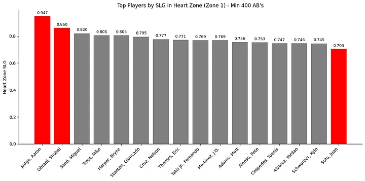

No surprise: **Judge and Ohtani rank #1 and #2 in MLB** in slugging on Heart pitches.

Yet they continue to get pitched in the Heart at average rates.

---

### 🔍 Correlation Between Hitting Stats & Pitch Location

So I asked: how does location correlate with offensive performance across the league?

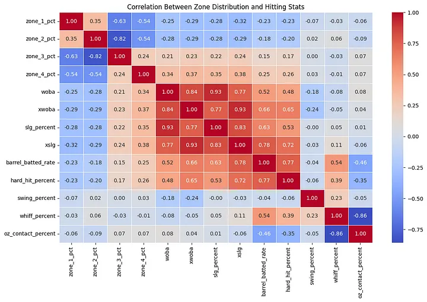  
Heatmap showing correlations between zone location and hitting metrics

Key findings:

- **Heart zone (Zone 1)**: Strong **negative correlation** with `wOBA`, `SLG`, `barrel%`, and `hard hit%`. The better the hitter, the fewer pitches they see in the Heart.
- **Shadow zone (Zone 2)**: Similar, but **slightly weaker** negative correlations.
- **Chase & Waste zones (Zones 3 & 4)**: Positive correlation. Better hitters see **more** pitches in these harder-to-hit regions.

In short: pitchers are avoiding the zone — particularly the Heart — against top hitters. But how much are they really adjusting?

---

### 🧪 ANOVA: Do Location Patterns Differ by Hitter Quality?

To measure **practical differences**, I ran a two-way ANOVA using three hitter tiers — **Elite**, **Average**, and **Poor** — and the three main pitch zones.

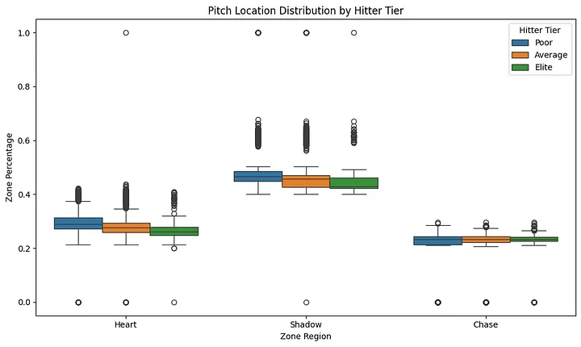

**Results:**
- All effects (hitter tier, zone, and their interaction) were statistically significant (p < 0.05).
- This confirms real differences in pitch location patterns by hitter quality and zone.

**But** — statistical significance ≠ practical significance.

The boxplot reveals **large overlap** in how zones are distributed across hitter tiers. So while elite hitters see slightly fewer Heart pitches and slightly more Shadow/Chase pitches, the overall differences are **minor**.

**Takeaway**: Pitchers make only **modest location adjustments** based on hitter quality. A consistent strategy is applied to most hitters, elite or not.

---

### 🔄 If Not Location, Then What? Let's Talk Pitch Type

Maybe pitchers aren’t changing location — but are they adjusting **pitch selection**?

To test this, I grouped hitters by wRC+ (a comprehensive offensive metric) into:

- **Above Average**
- **Average**
- **Below Average**

Then I looked at pitch mix across groups.

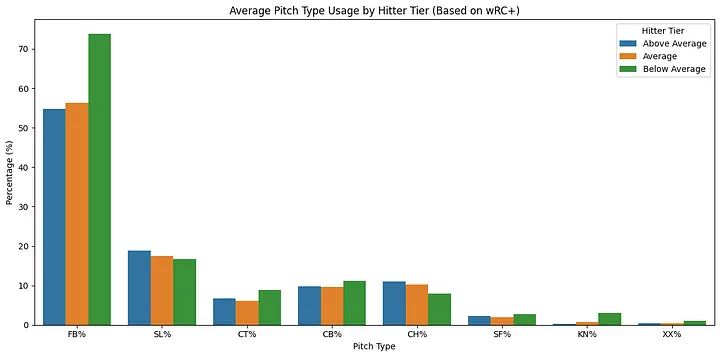
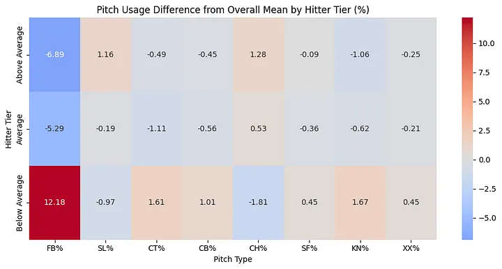

**Heatmap Insight:**
- **Below Average** hitters see **12.18% more fastballs** than league average.
- **Above Average** hitters see **6.89% fewer fastballs**.
- Changes in offspeed/breaking pitch usage are smaller, but the trend is clear.

Pitchers are **challenging weaker hitters with fastballs**, and relying on **deception** (offspeed pitches) against better hitters.

---

### 🔍 Fastballs vs. Offspeed: A Deeper Look

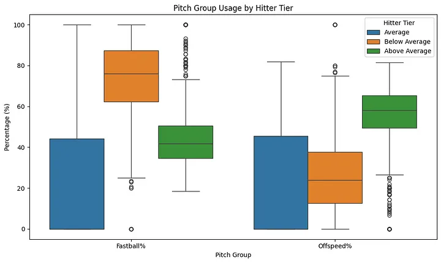

This chart breaks it down further by Fastball% and Offspeed%:

- **Below Average** hitters → More fastballs.
- **Above Average** hitters → More offspeed pitches.
- **Average** hitters sit in between.

---

### Final Takeaway

While pitch **location** only changes marginally with hitter quality, **pitch type** shows a more defined trend. Pitchers **reduce fastball usage** and mix in more breaking/offspeed stuff against better hitters — likely to avoid hard contact and disrupt timing.

So the strategy seems to be:
- **Pitch around with stuff**, not with location.

### So do we have an answer?

After diving into league trends, pitch location data, statistical models, and pitch type distributions, the answer to the central question — *Why are Judge and Ohtani still getting pitched to?* — becomes clearer, though still nuanced.

While there is **some strategic adjustment** in how pitchers approach elite hitters — particularly in pitch type — those adjustments are relatively **modest**, especially in terms of location. Elite hitters like Judge and Ohtani **do not receive significantly fewer pitches in the strike zone**, and they are pitched in the **heart of the plate at rates nearly identical to average hitters**. Even when looking at more granular location zones (Heart, Shadow, Chase, Waste), the **differences were statistically real but practically small**.

However, the strongest signal of strategic differentiation emerged when I looked at **pitch mix**. Pitchers appear to challenge **below average hitters with more fastballs**, while they **diversify and lean on offspeed and breaking pitches against elite hitters**. This suggests that **pitch type, not location**, is the primary lever pitchers pull when facing tough opponents.

So what does this tell us?

We are likely witnessing a new era in pitching — one built not around avoidance or fear, but **confidence in stuff**. With advancements in biomechanics, training, and pitch design, pitchers now possess arsenals that allow them to attack hitters head-on. The strategy isn’t to nibble or pitch around dangerous hitters — it’s to **throw elite pitches, even in hittable locations**, and trust that movement, velocity, and deception will do the job.

In essence, Judge and Ohtani are being treated *more similarly* to other hitters than expected — **not because pitchers don’t recognize their talent**, but because the **game has evolved to value stuff over strategy**. Pitchers aren’t tailoring location as much as they’re trusting what they throw.

The real takeaway might not be that pitchers are making a mistake — it’s that they believe the **stuff is good enough to beat anyone**. Even the best.
